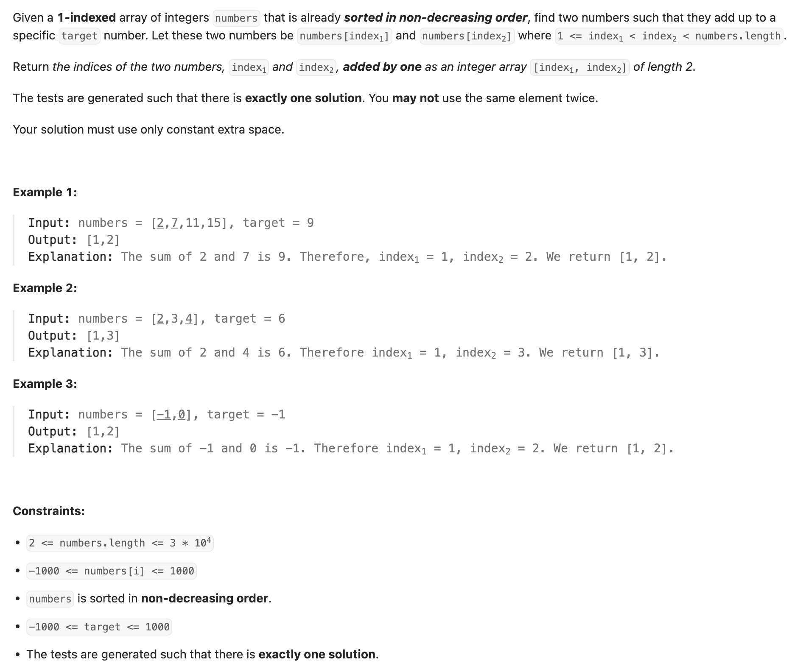

## 167. Two Sum II - Input Array Is Sorted

---

```java
class Solution {
    public int[] twoSum(int[] numbers, int target) {
        int left = 0, right = numbers.length - 1;
        while (left < right) {
            if (numbers[left] + numbers[right] == target) {
                return new int[]{left + 1, right + 1};
            } else if (numbers[left] + numbers[right] < target) {
                left++;
            } else {
                right--;
            }
        }
        return new int[]{-1, -1};
    }
}
```