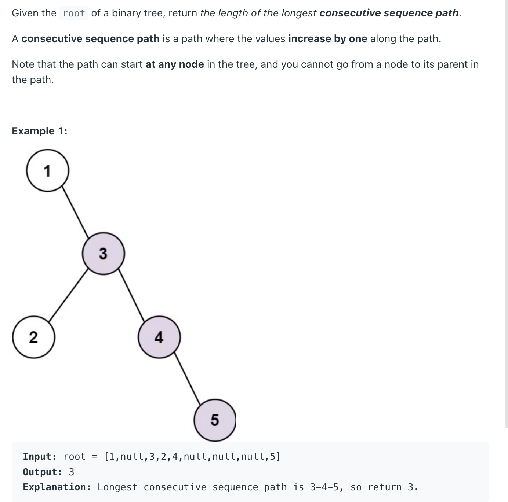
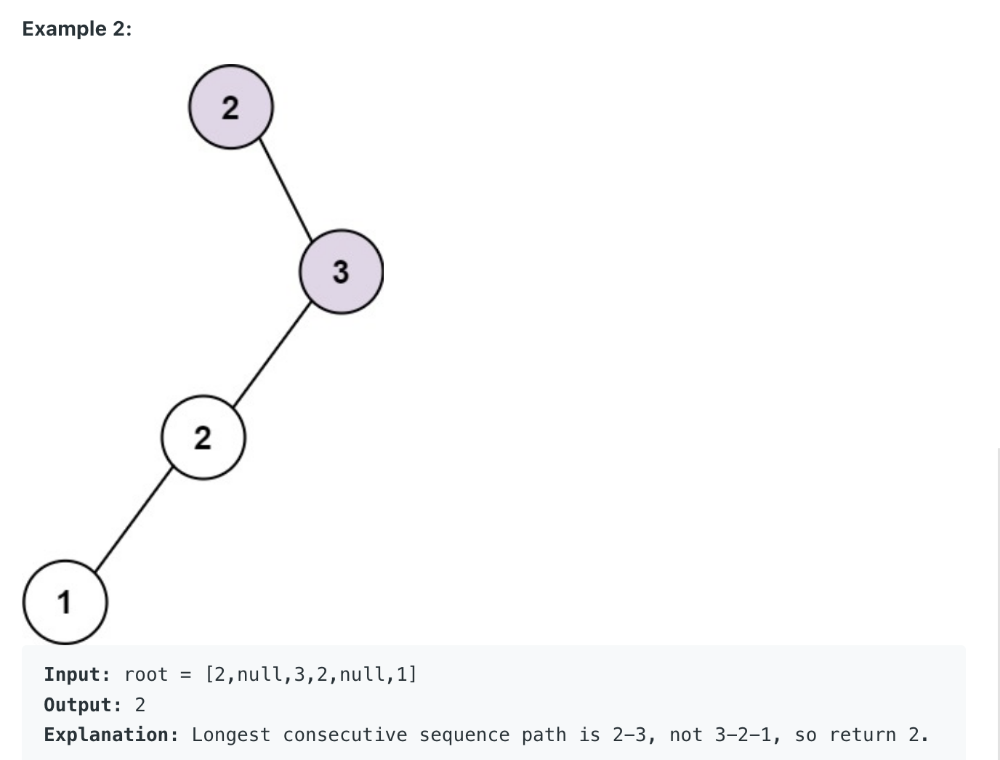

## 298. Binary Tree Longest Consecutive Sequence


---

```java
class Solution {
    public int longestConsecutive(TreeNode root) {
        int[] max = new int[1];
        dfs(root, max);
        return max[0];
    }

    private int dfs(TreeNode root, int[] max) {
        if (root == null) {
            return 0;
        }
        int curMax = 1;
        int left = dfs(root.left, max);
        int right = dfs(root.right, max);
        if (root.left != null && root.val + 1 == root.left.val) {
            curMax = Math.max(left + 1, curMax);
        }
        if (root.right != null && root.val + 1 == root.right.val) {
            curMax = Math.max(right + 1, curMax);
        }
        max[0] = Math.max(max[0], curMax);
        return curMax;
    }
}
```