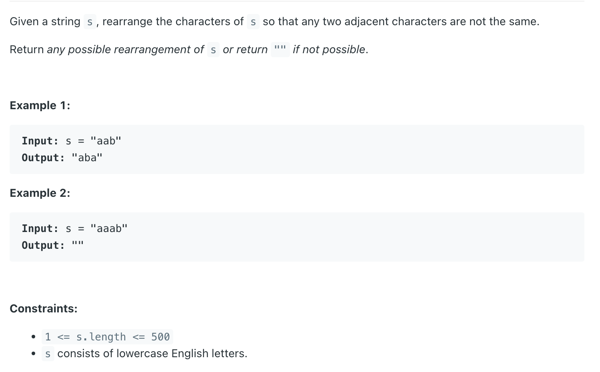

## 767. Reorganize String


```ruby
    s = "aaabbcc"

    map = {
        'a' : 3
        'b' : 2
        'c' : 2
    }


    res =  "a b c a b c a"    
```
    
---

- why use `int[] prev = new int[]{-1, 0}` ?
  -  Without this mechanism, the algorithm might **place the same character twice consecutively**


```java
class reorganizeString_heap {
    public String reorganizeString(String s) {
        int[] freq = new int[26];
        for (char c : s.toCharArray()) {
            freq[c - 'a']++;
        }
        PriorityQueue<int[]> maxHeap = new PriorityQueue<>((a, b) -> b[1] - a[1]);
        for (int i = 0; i < 26; i++) {
            if (freq[i] != 0) {
                maxHeap.offer(new int[]{i, freq[i]}); // add char counts to priority queue
            }
        }

        int[] prev = new int[]{-1, 0};
        StringBuilder sb = new StringBuilder();
        while (!maxHeap.isEmpty()) {
            int[] cur = maxHeap.poll();
            if (prev[1] > 0) {
                maxHeap.offer(prev); // add back last used character
            }
            sb.append((char) (cur[0] + 'a'));
            cur[1]--; // decrease count of current char since it's used
            prev = cur; // set this character as previous used
        }

        if (maxHeap.isEmpty() && prev[1] > 0) {
            return ""; // if we left with anything return ""
        }
        return sb.toString();
    }
}
```


---


#### bucket sort

```java
class reorganizeString_bucketsort {
    public String reorganizeString(String s) {
        if (s == null || s.length() < 2) return s;
        int[] bucket = new int[26];
        for (int i = 0; i < s.length(); i++) {
            bucket[s.charAt(i) - 'a']++;
        }
        int max = 0;
        for (int i = 0; i < bucket.length; i++) {
            if (bucket[i] > bucket[max]) {
                max = i;
            }
        }
        if (bucket[max] > (s.length() + 1) / 2) return "";

        char[] ans = new char[s.length()];
        int start = 0;
        for (int i = 0; i < ans.length; i = i + 2) {
            if (bucket[max] > 0) {
                ans[i] = (char) ('a' + max);
                bucket[max]--;
            } else {
                while (bucket[start] == 0) {
                    start++;
                }
                ans[i] = (char) ('a' + start);
                bucket[start]--;
            }
        }
        for (int i = 1; i < ans.length; i = i + 2) {
            while (bucket[start] == 0) {
                start++;
            }
            ans[i] = (char) ('a' + start);
            bucket[start]--;
        }
        return new String(ans);
    }
}
```
