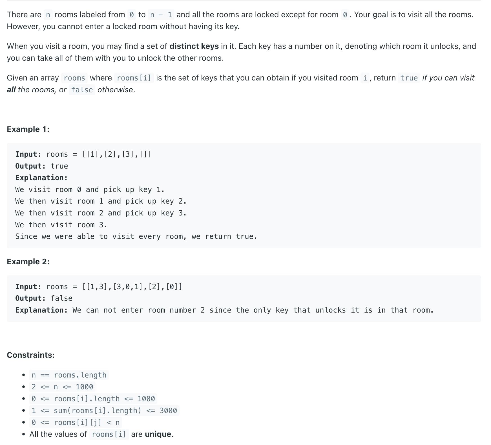
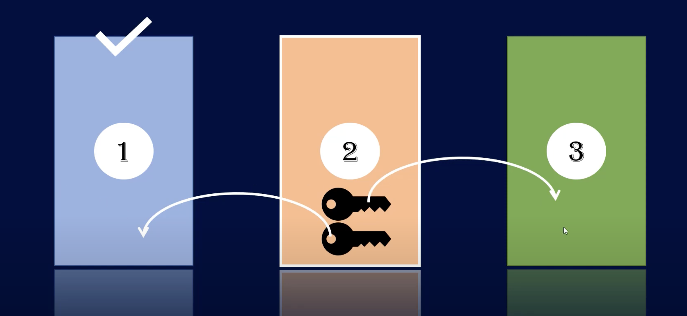
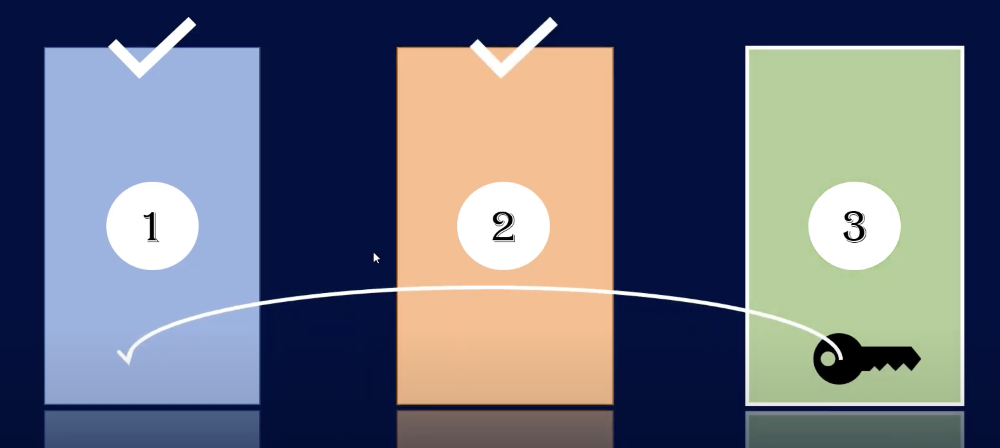

## 841. Keys and Rooms

---

- [youtube](https://www.youtube.com/watch?v=8iUFLUIeK9k)



- mark door1 to be visited.



---

```java
class _841_KeysAndRooms {
    boolean[] visited;
    public boolean canVisitAllRooms(List<List<Integer>> rooms) {
        visited = new boolean[rooms.size()];
        visited[0] = true;
        dfs(rooms, 0);

        for (boolean visit : visited) {
            if (!visit) {
                return false;
            }
        }
        return true;
    }

    public void dfs(List<List<Integer>> rooms, int index) {
        for (int key : rooms.get(index)) {
            if (!visited[key]) {
                visited[key] = true;
                dfs(rooms, index);
            }
        }
    }
}
```